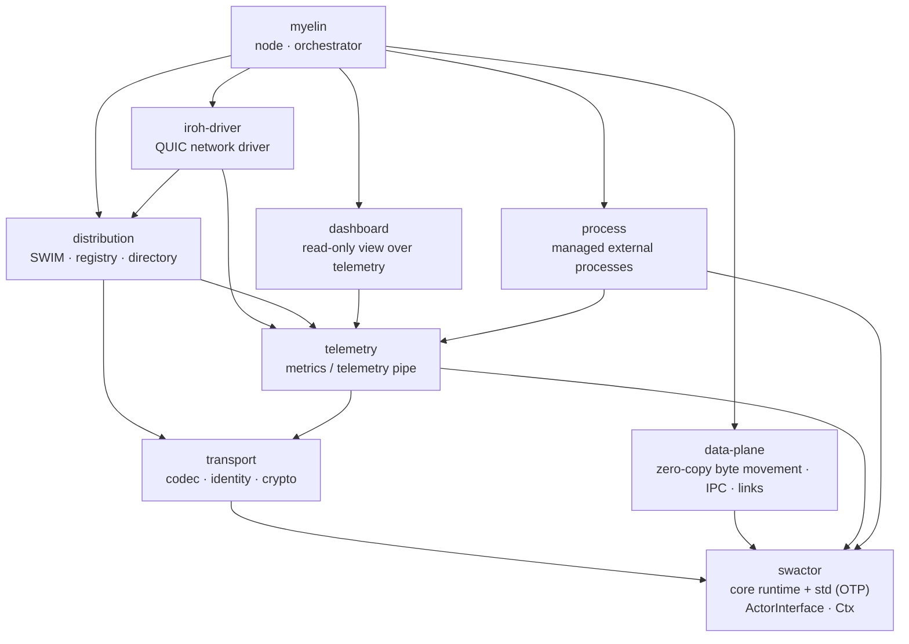

# swactor

A small, WASM-first actor runtime for Rust: one trait, location-transparent
addresses, and a built-in cluster. Actors are ordinary structs; a message is
any `Clone + Send + Sync` type; an address works the same whether the actor
lives in this process, on a peer, or behind NAT on another node.

## See it run

One command boots a supervisor — a real swactor engine with a real `iroh`
endpoint and the dashboard — plus a fleet of node processes that join it over
QUIC, then keeps that fleet alive:

```sh
cargo xtask demo    # --nodes 8 --port 9871 --docker also work
```

Open the dashboard it prints and watch the system act like one:

- **Fleet Control** (`/view/demo-control`) — the reconciler's
  current-vs-desired state as counters, each node's stage
  (`New → LeaseRequested → … → SwactorJoined → HandedOff`), and the
  command/result feeds. Press **kill** on a node: the reconciler notices the
  death and provisions a replacement, for real.
- **Fleet** (`/view/fleet`) — per-node cards with PID and lifecycle; click
  through to an actor roster and per-actor dossier.

Nodes are ordinary child processes (or, with `--docker`, scratch containers
on their own bridge network), so `kill -9` from a shell triggers the same
recovery. Ctrl-C tears everything down.

## What it is

Every actor is one trait. There is no separate message trait to implement —
anything `Clone + Send + Sync` is a message by blanket impl:

```rust
// src/actor.rs
pub trait Message: 'static + Sized + Clone + Send + Sync {}
impl<T: 'static + Sized + Clone + Send + Sync> Message for T {}

pub trait ActorInterface: 'static + Send {
    type Incoming: Message;
    type Response: Message;
    fn handle(&mut self, ctx: &Ctx, msg: Self::Incoming);
    // ...on_start, on_stop, handle_down (death monitoring) as needed
}
```

You can drive core explicitly with `SingleThreadRuntime` (the WASM-friendly
host) or hand `RuntimeParts` to an engine substrate:

```rust
use swactor::actor::{ActorInterface, Ctx};
use swactor::runtime::{RuntimeConfig, RuntimeParts, SingleThreadRuntime};

struct Counter { count: u64 }

impl ActorInterface for Counter {
    type Incoming = ();            // `()` is Clone + Send + Sync, so it's a message
    type Response = ();
    fn handle(&mut self, _ctx: &Ctx, _: Self::Incoming) {
        self.count += 1;
        println!("hit #{self.count}");
    }
}

fn main() -> Result<(), swactor::Error> {
    let parts = RuntimeParts::new(RuntimeConfig::default()); // 1 worker by default
    let rt = parts.runtime().clone();
    let mut host = SingleThreadRuntime::new(parts);
    let addr = rt.spawn(Counter { count: 0 })?;
    rt.send_to(addr, ())?;
    for _ in 0..3 { host.tick(); }                         // spawn → handle → done
    Ok(())
}
```

`RuntimeConfig` exposes worker count, actor/worker ingress budgets, actor
capacity, and channel buffer sizing. The per-tick actor budget is inspired by
BEAM's reduction count, so one chatty mailbox can't starve the rest.

## Features

Each feature is shown in the code that implements it.

### Route messages by actor_id across cluster boundaries

An actor's identity is a 32-byte address, not a pointer:

```rust
// src/actor.rs
pub struct ActorAddress(pub [u8; 32]);
```

You send to it the same way whether it lives in this process, on a peer across
the room, or behind NAT on another continent — one call, `ctx.send(addr, msg)`.
The locality decision is exactly one address-map lookup; a miss hands the
message to the cluster transport instead of a local worker:

```rust
// src/delivery.rs — the cluster boundary
fn route_nonlocal(&self, addr: ActorAddress, msg: Box<dyn Any + Send>) -> Result<(), Error> {
    #[cfg(feature = "transport")]
    {
        if self.inbox_registry.contains(&addr) {        // a pending reply inbox
            return self.inbox_registry.try_deliver(addr, msg);
        }
        if let Some(sink) = self.remote_sink {          // ← off this node
            return sink.send(addr, msg);
        }
    }
    self.inbox_registry.try_deliver(addr, msg)
}
```

The transport seam is a single trait — any cluster driver satisfies it:

```rust
// src/runtime.rs
pub trait RemoteSink: Send + Sync {
    fn send(&self, addr: ActorAddress, msg: Box<dyn Any + Send>) -> Result<(), Error>;
}
```

Where `addr` lives is resolved from a signed, gossiped directory: a host-signed
`DirectoryEntry` binds `actor_addr → node_id`, backed by an LRU `LocationCache`.
The node's own mailbox (`node_id → ActorAddress`) is rebound on restart without
changing identity, which is why `NodeId` and `ActorAddress` are deliberately
distinct types.

### WASM by default

The same runtime that runs on a thread pool also compiles to `wasm32` and steps
one tick at a time from a host (browser, Node, an embedding app). Randomness,
timers, and the address map all have a no-op/wasm path behind the `wasm`
feature. The [ping-pong demo](examples/ping-pong) is one runtime compiled to a
`.wasm` cdylib and driven by Node:

```sh
cd examples/ping-pong && ./run.sh
```

### Built-in engine and driver, tasks included

A node ships batteries-included: the actor engine (worker threads), a network
driver, and the pump/fanout tasks that wire them — you don't assemble the glue.
The driver's edge surface is a deliberately tiny reader/writer port; all edge
logic — lifecycle, ring bookkeeping, ingress parsing — lives in the data-plane:

```rust
// crates/data-plane/src/edge_wire.rs — the whole transport contract
pub trait EdgeTransport {
    type Writer: EdgeWriter;
    type PeerAddr: Clone;
    fn open_writer(&mut self, edge_id: EdgeId, peer: &Self::PeerAddr)
        -> Result<Self::Writer, String>;
    fn drain_events(&mut self) -> Vec<WireEvent>;
}
// crates/iroh-driver: `impl EdgeTransport for IrohDriver`

### `iroh` integration — QUIC, TLS, and NAT traversal

The bundled driver is [iroh](https://iroh.computer): QUIC-based peer transport
with built-in TLS, NAT hole-punching, and relay-server fallback. You hand it a
Tokio engine and it runs accepts, dials, stream I/O, retries, and shutdown on
it; peers are admitted through an optional allow-list:

```rust
// crates/iroh-driver/src/iroh_driver.rs
pub struct IrohDriverConfig {
    pub secret_key: Option<SecretKey>,   // None → fresh random identity
    pub relay_mode: RelayMode,           // default: n0 production relays
    pub node: DistributedNodeConfig,
    pub peer_auth: Option<Arc<Mutex<PeerAllowList>>>,
    pub additional_alpns: Vec<Vec<u8>>,  // opaque to the driver
}
```

### Built-in SWIM cluster

Membership is a real SWIM implementation — direct + indirect (relay) probes,
suspicion timers, and Lifeguard local-health scaling — not heartbeats. The probe
state machine emits typed actions; the host adapter turns them into sends:

```rust
// crates/distribution/src/swim/probe.rs
pub enum SwimAction {
    SendPing { to: NodeId, sequence: u64 },
    SendPingReq { relay: NodeId, target: NodeId, sequence: u64 }, // indirect probe
    Suspect(NodeId),
    DeclareDead(NodeId),
    Diag(SwimDiagEvent), // RTT samples — observation only, no protocol effect
}
```

Name bindings, node metadata (relay URL, human name), and the actor→host
directory each run as independent gossip actors, so the cluster goes quiet once
it converges.

### OTP-style standard library

Behind the `std` feature, one extension adds the patterns you reach for:
symbolic naming, death monitoring (watching), and process groups. Install it on
the runtime and actors get `CtxWatching` / `CtxNaming`:

```rust
// src/std/extension.rs
pub struct StdExtension {
    name_registry: NameRegistry,    // logical names → addresses
    watch_registry: WatchRegistry,  // exit notifications
    group_registry: GroupRegistry,  // named groups / pub-sub
}
// runtime.with_extension(Arc::new(StdExtension::new()));
```

### Process manager for external processes

Treat an OS process like an actor. Describe it, spawn it onto the runtime, and
send it commands; its lifecycle (started / exited / signaled) arrives as
messages:

```rust
// crates/process/src/types.rs
pub struct ProcessSpec {
    pub command: String,
    pub args: Vec<String>,
    pub env: HashMap<String, String>,
    pub working_dir: Option<std::path::PathBuf>,
    pub label: Option<String>,
}
```

### Zero-copy movement of large byte objects

The data-plane ships large, *typed* byte objects between actors — and across
nodes — without copying. The motivating workload is sharded inference: one GPU's
output activation is the next GPU's input, so it rides a bounded ring leased from
a shared arena. A ring is either local (IPC between two actors on one node) or
the two ends of a QUIC edge:

```text
producer → egress ring ──QUIC──▶ ingress ring → consumer
           (arena lease; zero-copy at both ends)
```

What travels on a wire edge is typed, so the receiver knows what arrived:

```rust
// crates/data-plane/src/edge_lifecycle.rs
pub struct ObjectSpec {
    pub kind: ObjectKind,        // Activation
    pub dtype: DType,            // F16
    pub max_extent_bytes: u64,
}
```

The edge runtime owns the lifecycle: lease a byte range, install an ingress or
egress ring, and release it only with a `QuiescenceProof`, so a range is never
recycled under a live reader. The worker consumes whole objects off its ingress
ring as plain bytes:

```rust
// crates/data-plane/src/edge_runtime.rs
match read_object_record(buffer, object_spec, false)? {
    ObjectRecordRead::Incomplete => Ok(None),      // wait for more bytes
    ObjectRecordRead::Complete(record) => {        // a full activation arrived
        let bytes: Vec<u8> = buffer.drain(..record.total_len).collect();
        // ... written into the edge's arena ring, then loaded on the worker
    }
}
```

### Custom metrics through the telemetry

Telemetry is a deliberately dumb pipe: producers tag bytes with a channel id,
nothing in the middle interprets the payload, and views are read-time
projections. To add a metric stream, define a type and implement one constant —
no schema registry to negotiate with:

```rust
// crates/telemetry/src/record.rs
pub trait Record {
    const CHANNEL: &'static str;
}

// crates/data-plane/src/arena.rs — the arena publishes its own health this way
impl Record for ArenaSample {
    const CHANNEL: &'static str = ARENA_SAMPLE_CHANNEL; // "mvp.arena"
}
```

### Built-in dashboard

A read-only HTML/SSE dashboard renders the frames the telemetry already
carries — workers, the actor roster, per-actor dossiers, fleet hardware. It sends
no control signals back, so the whole thing is one Axum router:

```rust
// crates/dashboard/src/server.rs
fn router(state: AppState) -> Router {
    Router::new()
        .route("/", get(root_page))
        .route("/events", get(frame_stream))                 // live frames over SSE
        .route("/api/frames", get(recent_frames))
        .route("/api/views", get(views_json))
        .route("/api/view/{*path}", get(view_snapshot))
        .route("/view/{*path}", get(view_page))
        .with_state(state)
}
```

## Architecture

The workspace builds upward from a tiny core. Each crate is one responsibility:



| Crate | Role |
| --- | --- |
| `swactor` (`src/`) | Core runtime: the actor trait, `Ctx`, scheduler, address map, channels |
| `crates/transport` | Codec registry, node identity, message signing — transport-agnostic |
| `crates/distribution` | Clustering: SWIM membership, naming, metadata + actor directory gossip |
| `crates/iroh-driver` | iroh/QUIC network driver with its pump/fanout tasks |
| `crates/telemetry` | Metrics / telemetry pipe — nothing in the middle interprets payloads |
| `crates/data-plane` | Zero-copy movement of large typed byte objects over IPC or a network link |
| `crates/process` | Managed external process lifecycle and owned spawn resources |
| `crates/dashboard` | Read-only HTML/SSE dashboard over telemetry frames |
| `crates/provisioning` | Cloud node provisioning |
| `crates/bindings/{python,wasm-runtime,wasm-crypto}` | Language / target bindings |
| `apps/myelin` | The node binary that wires the above into a runnable cluster node |
| `tools/vastai` | Vast.ai GPU-marketplace tooling |

## Used for

- **A drop-in replacement for GPU jobs on cloud infrastructure.** `apps/myelin`
  ships an orchestrator plus a containerized worker node
  (`apps/myelin/node-image`) that provisions, stages models, and runs them.
- **Orchestration for sharded inference.** The standard node image ships only
  the Rust node; workload-specific images add Python bindings and framework
  runtimes such as tinygrad or the planned vLLM backend.

## Examples

**Working:** [`examples/ping-pong`](examples/ping-pong) — two actors volley on a
single-threaded runtime compiled to WebAssembly, driven tick-by-tick from Node.
Shows spawning, message passing, and death monitoring in one file.

**Planned** (tracked in `.deployment-notes/ROADMAP.md`):

- Two actors talking in-process, over IPC, and across a WAN — in Rust, Python,
  and WASM — from the same code.
- Typed chunk streaming across IPC or WAN.
- A non-trivially sharded training job (not easily expressed in Ray).
- A full pipeline-parallel example of a model sharded across N ≥ 3 cheap GPUs.

## Developing

Requires the pinned nightly toolchain (`rust-toolchain.toml`):

```sh
cargo check              # native default members
cargo lint              # compiler-enforced architecture and timeout policy
cargo xtask test          # see `cargo xtask --help`
```

The language bindings (`crates/bindings/*`) build on demand with `-p` or
`--workspace` using a supported language toolchain; normal native iteration
uses the workspace `default-members`.

The real-binary Myelin behavioral harness requires Docker and builds its
dedicated Python workload image on first use:

```sh
cargo run -p myelin-e2e-fuzz -- --smoke-only --deadline-secs 180
cargo run -p myelin-e2e-fuzz -- --failure-cases --deadline-secs 180
```

Omit `--smoke-only` for the deterministic ordered-pair corpus plus generated
short DAGs. Every case writes its IR, generated Python, observations, telemetry,
and any minimized regression under `target/e2e-behavioral-fuzz`.

## Status

swactor is early and under active development. The runtime, clustering, and the
`myelin` node are exercised by the workspace test suite, but APIs are still
moving.

## License

Licensed under the [GNU Affero General Public License v3.0 only]
(./LICENSE) (`AGPL-3.0-only`). The AGPL's network clause (§13) requires anyone
who runs a modified swactor as a network service to offer its source to users.
The copyright holder is not bound by their own license and may relicense future
releases freely; external contributors should expect a CLA requirement before
changes are merged.
