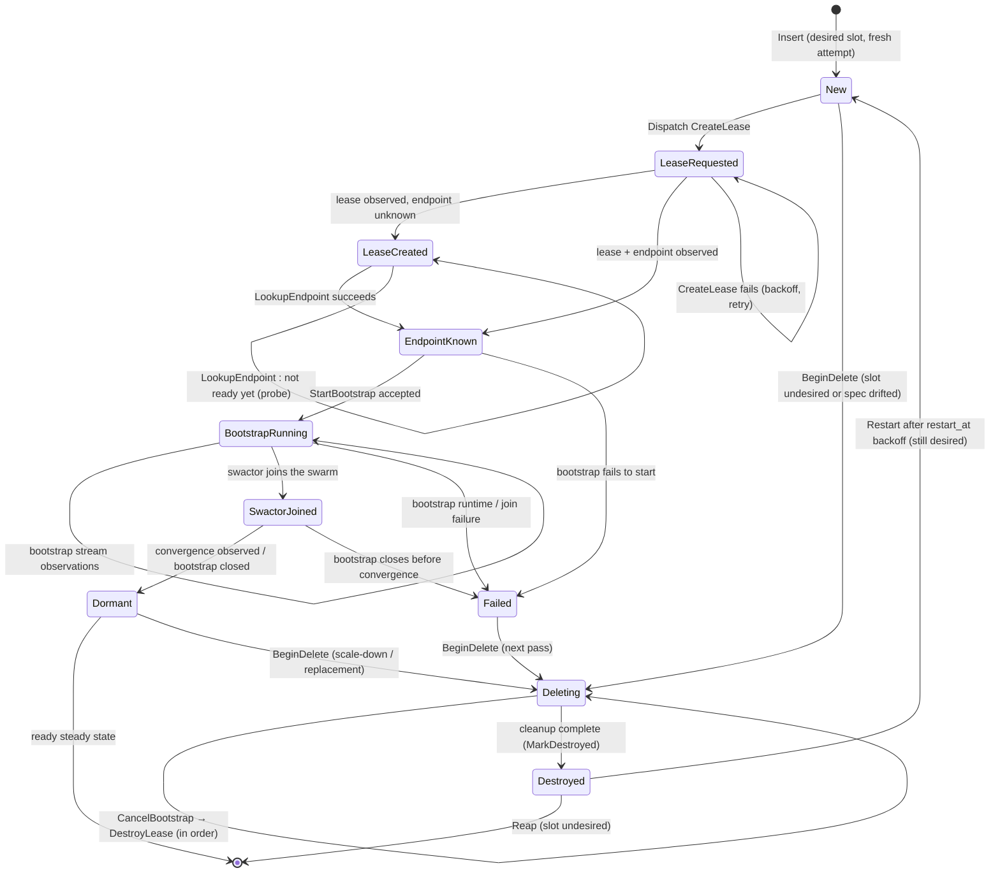

# provisioning — the cluster reconciler

This crate drives a declared cluster shape toward convergence. A caller states
*what the run should look like* — which node groups, how many of each, with what
provider shape and boot parameters — and the reconciler repeatedly compares that
desired shape against observed reality, taking the next safe step for each node
until the two match. It is modeled on Kubernetes controller mechanics
(level-triggered decisions, spec/status separation, workqueue-style coalescing,
finalizer-style deletion) but runs entirely in-process over the Swactor/Myelin
engine: there is no API server, and no persistence beyond the process lifetime.

The payoff over the imperative lifecycle it replaced: the system converges from
whatever state it is currently in. A reconcile pass is a pure function of
`(observed, desired, now)` — never of the event that triggered it — so missed
events, duplicated events, and crash-of-a-single-pass all heal on the next
pass. Reconcile is a function of state, not events.

## The three roles

One state-ownership rule upholds the design: **only the driver mutates observed
state.**

| Role | Embodiment | Responsibility |
|---|---|---|
| Decider | `reconcile` / `reconcile_node` | Pure, deterministic: reads state snapshots, returns next actions. No I/O, no clocks, no randomness. |
| Driver | `ClusterDriver` | Sole writer of `ClusterState`. Folds observations, coalesces triggers, runs passes, records operations as pending *before* dispatch, schedules requeues. |
| Executor | `EffectExecutor` / `IdempotentEffectExecutor` + a provider `EffectBackend` | Runs provider I/O off the pass, deduplicates by operation identity, adopts resources after ambiguous outcomes. |

## Inputs

**Desired state** — `ClusterShape { run_id, generation, groups }`. It expands to
one `LogicalNodeSpec` per slot named `{group_id}-{index}`; validation rejects
cross-run groups, duplicate group or node IDs, and non-finite shape values.
The driver additionally enforces a revision contract: the run ID is fixed for
its lifetime, `generation` must strictly increase whenever shape content
changes, and changed content at the same generation is rejected. A node's spec
is an immutable attempt template — any drift (image, boot, role, provider,
swarm-join) means *replace the attempt*, never mutate it in place.

**Observed state** — `ClusterState`: the last-evaluated generation, a monotonic
attempt-ID allocator, and one `ManagedNode` per logical slot. A `ManagedNode`
carries its attempt ID, intent (`Active` / `Deleting`), the lifecycle-fact
record (`NodeRecord`), at most **one** pending operation, and per-node retry
state. Identity is layered: a `LogicalNodeId` is the stable slot;
a `NodeAttemptId` names one incarnation of that slot (like a k8s object name
vs its UID); an `OperationId` (attempt + sequence) names one dispatched effect.
Results from an old attempt can never mutate a newer one.

**Events** — executor results, bootstrap stream observations, timeouts, and a
periodic tick. Events carry no decision input; they only mark the cluster
dirty and are folded into observed state before the next pass looks.

## Reconciliation flow

Per node, progress is a ladder of stages crossed by one effect at a time, with
a deletion track that runs to completion once entered:

A pass picks **at most one action per node**; a driver transition
(`Insert`, `BeginDelete`, `MarkDestroyed`, `Restart`, `Reap`) completes that
node's step, and its follow-on effect is considered in a later pass. Nodes
progress independently — one node's slow provider I/O never blocks another.

### The per-pass decision ladder

For each node, the decider's rules in priority order (first match wins):

| # | Condition | Action |
|---|---|---|
| 1 | stage `Destroyed`, slot undesired | `Reap` — remove from the map |
| 2 | stage `Destroyed`, slot desired, `restart_at` due | `Restart` — fresh attempt, latest spec |
| 3 | stage `Destroyed`, restart backoff not due | wait until `restart_at` |
| 4 | intent `Active` and (undesired, spec drift, or stage `Failed`) | `BeginDelete` |
| 5 | an operation is pending | wait for its result or stored deadline |
| 6 | intent `Deleting`, ambiguous create/bootstrap remembered | re-dispatch that create (executor adopts) |
| 7 | intent `Deleting`, active bootstrap session | `CancelBootstrap` |
| 8 | intent `Deleting`, lease still live | `DestroyLease` |
| 9 | intent `Deleting`, nothing left to clean | `MarkDestroyed` |
| 10 | retry backoff (`next_effect_at`) not due | wait |
| 11 | ready in `HandedOff` / `Dormant` | none — steady state |
| 12 | no lease | `CreateLease` |
| 13 | lease but no SSH endpoint | `LookupEndpoint` |
| 14 | stage `SwactorJoined` with live session | `BootstrapConvergenceObserved` |
| 15 | bootstrap running, awaiting observations | none — await stream events |
| 16 | lease + endpoint, no bootstrap session | `StartBootstrap` |

Rows 1–4 handle topology (scale up is an `Insert` seen before row 1); rows
5–10 handle in-flight work and deletion; rows 11–16 are the healthy
progression ladder. Cleanup ordering is deliberately sequential — cancel
bootstrap, then destroy the lease, then mark destroyed — so partial success is
never ambiguous.

## Triggers and requeues

The driver is the process-local equivalent of a single-key Kubernetes
workqueue: one pass runs at a time (reentry is an error), triggers while
queued collapse, and a trigger during a pass marks dirty and guarantees exactly
one follow-up pass.

| Trigger | Source | Effect |
|---|---|---|
| Desired shape update | `update_desired` (validated, generation advanced) | queue a pass |
| Executor result | operation completed / failed | fold observation, queue a pass |
| Bootstrap observation | stream stage, swactor join, closure, failure | fold observation, queue a pass |
| Operation timeout | stored pending-operation deadline | fold as ambiguous failure, queue a pass |
| Retry / probe / restart deadline | `trigger_if_due(now)` against `requeue_at` | queue a pass |
| Periodic wake | host tick (safety net, not the progress mechanism) | queue a pass if due |

Every pass recomputes `requeue_at` as the earliest deadline among waiting
nodes (pending-operation deadlines, backoff, probes, restarts). The host
(`apps/myelin`'s `ProvisionedClusterGuard`) drives `drive_until_blocked` on
each wake and re-arms the timer.

## Node conditions

`NodeStage` is the observation ladder; `ready` is the convergence flag:

| Stage | Meaning |
|---|---|
| `New` | slot inserted, nothing dispatched yet |
| `LeaseRequested` | `CreateLease` dispatched, pending |
| `LeaseCreated` | provider lease exists; SSH endpoint not yet known |
| `EndpointKnown` | lease + reachable SSH endpoint recorded |
| `BootstrapRunning` | bootstrap session started; stream observations flowing |
| `SwactorJoined` | the node's swactor joined the swarm |
| `HandedOff` | host marked handoff complete (reserved; the ready-check accepts it) |
| `Dormant` | bootstrap finished, handoff recorded — **ready** steady state |
| `Failed` | attempt-ending failure recorded (`failed_reason`, `failed_at`) |
| `Destroyed` | cleanup finished; awaiting reap or restart |

Bootstrap internals (`BootstrapStage`: SSH connect, boot check, swactor start,
join, converged, plus five failure stages) are facts folded into the record;
they update progress but the reconciler only branches on their failure/converged
classes, never on individual stream events.

## Failure and backoff

Not every failed call kills an attempt. Classification by operation:

| Failure | Retained state | Behavior |
|---|---|---|
| `CreateLease` | nothing | retry after exponential backoff |
| `LookupEndpoint` (not ready) | lease | re-probe on probe interval — not a failure |
| `LookupEndpoint` (error) | lease | retry after backoff |
| `StartBootstrap`, bootstrap runtime, or join | facts for observability | **attempt fails**: cleanup starts immediately; backoff applies to the *restart*, not the cleanup |
| `CancelBootstrap` / `DestroyLease` | stay in `Deleting` | retry after backoff |
| any timeout / ambiguous create | remembered | retry re-issues the same create so the executor adopts first |

Backoff is per node: exponential from 1 s to a 60 s cap (defaults), with
optional jitter sampled *deterministically* from the attempt ID — the decider
never reads randomness or a clock. Deadlines are computed once when an
observation is folded and stored; the pure decider only reads them. Reaching
ready resets the failure count. A failed attempt's `consecutive_failures`
carries into its replacement so hot-restart loops still back off.

## What is guaranteed

| Class | Guarantee |
|---|---|
| Determinism | Identical traces converge to identical state; execution order of independent work doesn't matter; a pass over a settled machine is a no-op. |
| Attempt isolation | Attempt IDs are never reused; results and facts from a superseded or retired attempt are discarded, never folded or leaked into a replacement. |
| No unrecorded effects | Every effect is recorded as pending before submission; one pending operation per node, one running per attempt; a destroyed node holds no lease, session, or pending operation; failed cleanup keeps its live facts. |
| Failure classification | Per-node backoff with one stored deadline; attempt failure cleans up immediately and delays only the restart; endpoint-not-ready is a probe, not a failure; ambiguous outcomes adopt before any destructive step; exhaustion and clock saturation are errors, never spins or panics. |
| Bounded convergence | Converges to the latest desired shape — intermediate generations may be skipped — in bounded rounds once faults stop; scale-down removes only highest-index slots; replacement starts a fresh attempt only after full cleanup; generation regressions and silent shape changes are rejected. |

## Operation identity and idempotency

A deterministic plan is not by itself a safe side effect; safety comes from the
identity contract:

- The driver records an operation as pending **before** dispatch and never
  emits a second operation for a node while one is pending. If submission
  itself fails, that folds as an operation failure — no unrecorded in-flight
  effect is ever observable.
- The executor deduplicates by `OperationId`: resubmitting a completed
  operation replays its recorded result; reusing an ID with different input is
  rejected; at most one operation runs per attempt at a time.
- Provider backends must key external requests on
  `(run_id, logical_node_id, attempt)` and **adopt** an existing resource for
  that identity before creating anew; cancel/destroy treat "already absent" as
  success.
- Timeouts expire an operation as *ambiguous* only after the executor
  classifies it; a late completion is discarded rather than folded.

## Convergence and boundaries

The cluster is converged for a generation when every desired slot holds the
exact desired spec with `ready`, `Active` intent, and no pending operation,
and no undesired or deleting nodes remain. `observed_generation ==
generation` alone means only "the driver has evaluated that shape," not
readiness.

Deliberately out of scope (v1): persistence and crash recovery — the identity
and adoption rules are the shape a later durability guarantee would build on —
leader election, availability-budgeted rollouts, and any provider-specific
behavior (backends live in application crates). The normative design spec,
including the full invariants list, is archived at
`docs/specs/archive/RECONCILER_SPEC.md`.
