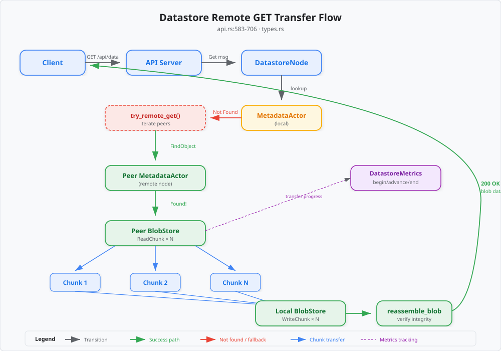
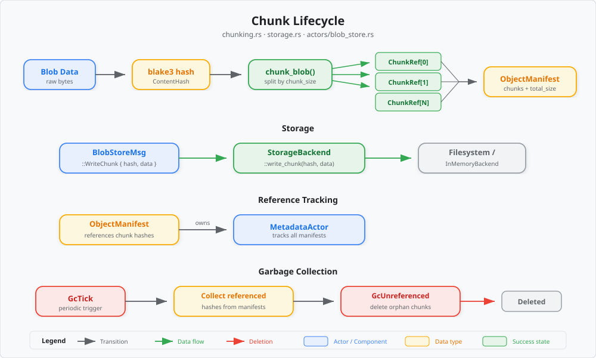

# Datastore Streaming Architecture

## Overview

"Streaming" in the swactor datastore refers to **progressive chunk-based transfer**, not byte-level streaming. When an object is stored, it is split into fixed-size chunks, each content-addressed with blake3. When retrieved from a remote peer, chunks are fetched individually and reassembled — enabling progress tracking and partial recovery.

This design trades a small amount of per-chunk overhead for:
- **Progress visibility**: the dashboard shows `chunks_received / chunks_total` in real time
- **Resumability**: a failed transfer can (in principle) restart from the last chunk
- **Deduplication**: identical chunks across objects are stored once

## Content-Addressed Chunking

The `chunk_blob()` function (`chunking.rs`) splits raw bytes into fixed-size pieces:

1. Compute `ContentHash = blake3(entire_blob)` — this is the object's identity
2. Split the blob into `ceil(total_size / chunk_size)` pieces (default chunk size: 1 MB)
3. For each piece, compute `chunk_hash = blake3(piece_bytes)`
4. Build a `ChunkRef { hash, offset, size }` for each piece
5. Return an `ObjectManifest` containing the full list of `ChunkRef`s

```
Blob (5.2 MB, chunk_size=1MB)
├── Chunk 0: hash=abc1…, offset=0,       size=1048576
├── Chunk 1: hash=def2…, offset=1048576,  size=1048576
├── Chunk 2: hash=789a…, offset=2097152,  size=1048576
├── Chunk 3: hash=bcd3…, offset=3145728,  size=1048576
└── Chunk 4: hash=ef45…, offset=4194304,  size=1048576  (last: 209920 bytes)
```

The object's identity (`ContentHash`) is the hash of the *entire* blob, not of the manifest. This means the same data always produces the same hash regardless of chunk size.

## Transfer Protocol

When a client requests an object via `GET /api/data?hash=...`, the API server:

1. Sends a `DatastoreNodeMsg::Get` to the local `DatastoreNode` actor
2. If found locally, reads all chunks from the local `BlobStore` and reassembles
3. If **not found locally**, enters `try_remote_get()`:



### Remote GET step-by-step

1. **Iterate peers**: for each known peer node:
2. **FindObject**: send `MetadataMsg::HandleFindObject` to the peer's `MetadataActor`
3. **Read manifest**: send `BlobStoreMsg::ReadManifest` to the peer's `BlobStore`
4. **Fetch chunks**: for each `ChunkRef` in the manifest:
   - Send `BlobStoreMsg::ReadChunk` to the peer
   - Receive `DatastoreResponse::ChunkOk { hash, data }`
   - Store locally via `BlobStoreMsg::WriteChunk`
   - Update `DatastoreMetrics::advance_transfer()` for dashboard progress
5. **Store manifest locally**: `BlobStoreMsg::WriteManifest`
6. **Store metadata locally**: `MetadataMsg::PutObject`
7. **Reassemble and respond**: `reassemble_blob()` concatenates chunks and verifies integrity

If a peer doesn't have the object (or any step fails), the loop continues to the next peer.

## Reassembly

`reassemble_blob()` (`chunking.rs`) takes a manifest and a set of `(hash, data)` pairs:

1. For each `ChunkRef` in manifest order, find the matching `(hash, data)` pair
2. Concatenate all chunk data into a single buffer
3. Compute `blake3(result)` and verify it matches `manifest.content_hash`
4. Return the reassembled blob (or a `ChunkingError` on mismatch)

This integrity check ensures that even if individual chunks are corrupted or swapped, the final result is always verified against the original content hash.

## Progress Tracking

The `DatastoreMetrics` struct provides thread-safe transfer tracking:

```
begin_transfer(hash, chunks_total)    // called when remote GET starts
advance_transfer(hash)                // called after each chunk is stored locally
end_transfer(hash)                    // called on completion or failure
```

The dashboard SSE stream includes a `datastore` event every ~200ms with a `DatastoreSnapshot` containing `active_transfers: Vec<TransferProgress>`. The web UI renders these as animated progress bars.

```
TransferProgress {
    hash: "abc123...",
    chunks_received: 3,
    chunks_total: 5,
}
```

## GC Integration

When an object is deleted, its `ObjectEntry` and `ObjectManifest` are removed from the `MetadataActor`. However, the underlying chunks are **not immediately deleted** — they may be referenced by other manifests (deduplication).

Instead, garbage collection runs periodically:

1. `MetadataMsg::GcTick` triggers a scan
2. The `MetadataActor` collects all chunk hashes referenced by any live manifest
3. Sends `BlobStoreMsg::GcUnreferenced` with the referenced set
4. The `BlobStore` deletes any chunks **not** in the referenced set

This two-phase approach prevents data loss when chunks are shared between objects.


